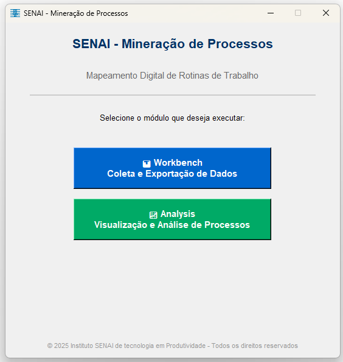
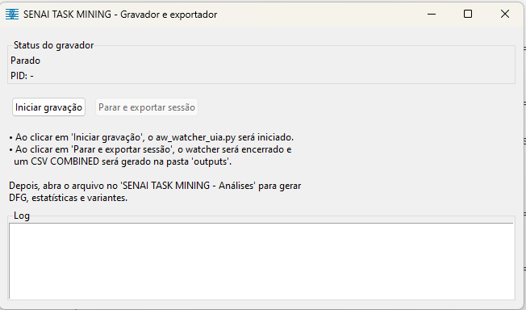
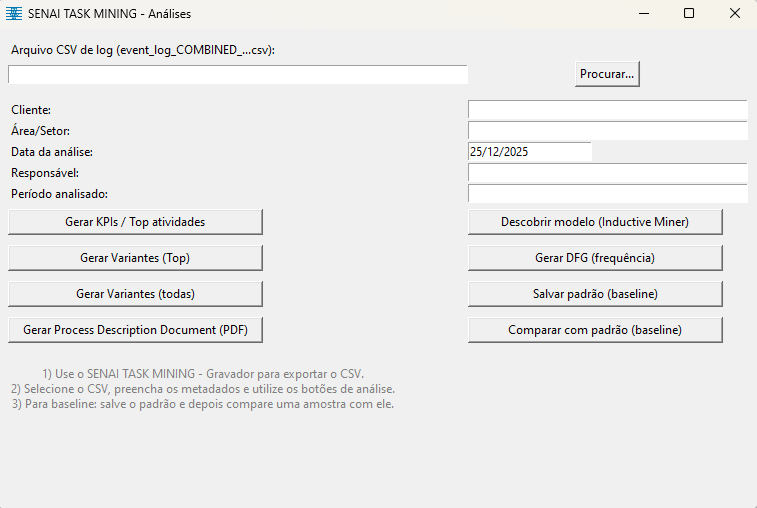
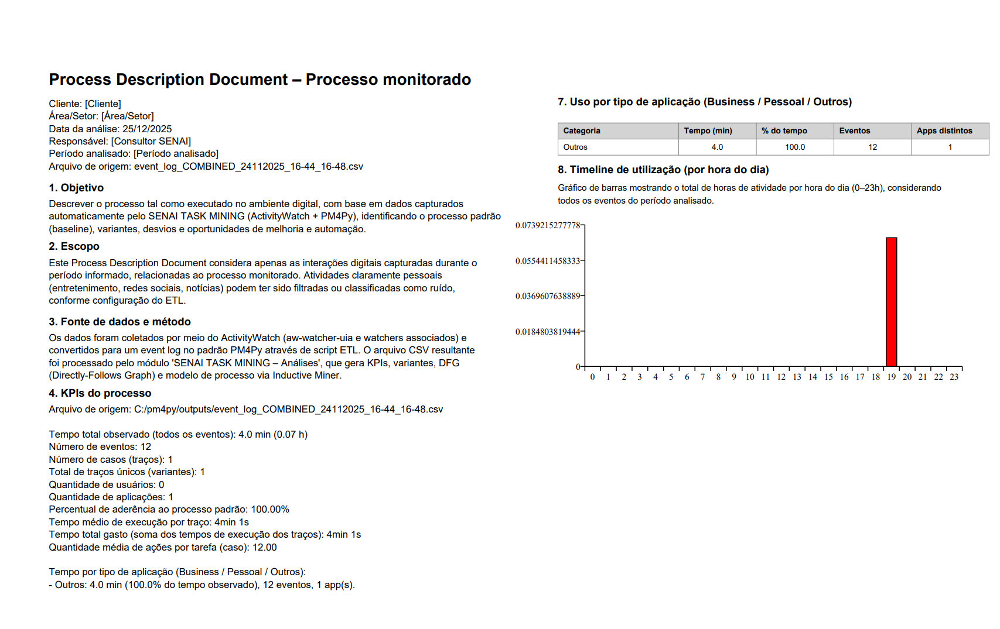

# SENAI Process Mining Suite

**Mapeamento Digital de Rotinas de Trabalho**

[](LICENSE)
[](https://www.python.org/downloads/)
[]()

## 📋 Sobre o Projeto

O **SENAI Process Mining Suite** é uma solução completa para captura, análise e visualização de processos de trabalho através de Task Mining. O sistema utiliza tecnologias de monitoramento não-invasivo para mapear digitalmente as rotinas de trabalho, gerando insights valiosos para otimização, padronização e automação de processos.

### 🎯 Características Principais

- **📊 Workbench (Coleta)**: Gravação automática de interações do usuário com aplicações
- **📈 Analysis (Análise)**: Análise avançada com Process Mining (PM4Py)
- **📄 Relatórios Profissionais**: Geração automática de PDFs com KPIs e visualizações
- **🔄 Baseline & Conformance**: Comparação entre processos atual e padrão
- **📊 Visualizações**: DFG, Petri Nets, Variantes e Timeline
- **🚀 Zero Configuração**: Executável standalone sem necessidade de instalação

---

## 🖥️ Requisitos do Sistema

### Para Uso do Executável (Cliente Final)

- **Sistema Operacional**: Windows 10/11 (64-bit)
- **RAM**: Mínimo 4GB (recomendado 8GB+)
- **Espaço em Disco**: ~500MB para instalação + espaço para logs
- **Requisitos Adicionais**: 
  - ActivityWatch Server rodando localmente
  - Permissões de leitura/escrita em `Documentos`

### Para Desenvolvimento

- **Python**: 3.8 ou superior
- **Dependências**: Ver `requirements.txt`
- **Sistema Operacional**: Windows 10/11 (desenvolvimento), Linux/macOS (contribuição)

---

## 📦 Instalação

### Opção 1: Executável Standalone (Recomendado para Usuários)

1. Baixe a última versão em [Releases](releases/)
2. Extraia o arquivo ZIP
3. Execute `SENAI_Mineracao_Processos.exe`
4. Não requer instalação!

### Opção 2: Desenvolvimento (Python)

```bash
# Clone o repositório
git clone https://github.com/seu-usuario/senai-process-mining.git
cd senai-process-mining

# Crie ambiente virtual
python -m venv .venv
.venv\Scripts\activate

# Instale dependências
pip install -r requirements.txt

# Execute o launcher
python pm_suite_entry.py
```

---

## 🚀 Uso Rápido

### 1️⃣ Workbench - Coleta de Dados

1. Abra o **SENAI Process Mining Suite**
2. Selecione **"Workbench"**
3. Clique em **"Iniciar gravação"**
4. Realize suas atividades normalmente
5. Clique em **"Parar e exportar sessão"**
6. O CSV será salvo em `Documentos\SENAI_ProcessMining\outputs`

### 2️⃣ Analysis - Análise de Processos

1. No launcher, selecione **"Analysis"**
2. Clique em **"Procurar..."** e selecione o CSV exportado
3. Preencha os metadados (Cliente, Área, etc.)
4. Utilize os botões de análise:
   - **Gerar KPIs**: Estatísticas do processo
   - **Gerar Variantes**: Diferentes caminhos do processo
   - **Gerar DFG**: Grafo de frequência
   - **Gerar PDD**: Relatório completo em PDF
   - **Salvar Baseline**: Salvar processo padrão
   - **Comparar com Baseline**: Análise de conformidade

---

## 📊 Tipos de Análises Disponíveis

| Análise | Descrição | Output |
|---------|-----------|--------|
| **KPIs** | Tempo total, casos, variantes, aderência | TXT + CSV |
| **Variantes** | Diferentes fluxos do processo | TXT + CSV |
| **DFG** | Grafo de frequência (Directly-Follows) | PNG + SVG |
| **Inductive Miner** | Modelo Petri Net do processo | PNG + SVG |
| **PDD** | Process Description Document completo | PDF |
| **Baseline** | Salvamento do processo padrão | PKL |
| **Conformance** | Comparação com baseline | PDF |

---

## 📂 Estrutura de Outputs

Todos os arquivos gerados são salvos em:

```
C:\Users\[Usuario]\Documents\SENAI_ProcessMining\outputs\
├── event_log_COMBINED_[data]_[hora].csv
├── [arquivo]__kpis_resumo.txt
├── [arquivo]__kpis_top_atividades.csv
├── [arquivo]__apps_categories.csv
├── [arquivo]__variants_all.csv
├── [arquivo]__variants_top.txt
├── [arquivo]__dfg_frequency.png
├── [arquivo]__inductive_petri.png
├── [arquivo]__process_description_document.pdf
├── [arquivo]__baseline.pkl
└── [arquivo]__baseline_comparison.pdf
```

---

## 🏗️ Build do Executável

Para gerar o executável a partir do código-fonte:

```bash
# Ativar ambiente virtual
.venv\Scripts\activate

# Limpar builds anteriores
rmdir /s /q build dist

# Build com PyInstaller
pyinstaller pm_suite_entry.spec --clean --noconfirm

# Executável em: dist\SENAI_Mineracao_Processos\
```

Veja [docs/BUILD.md](docs/BUILD.md) para instruções detalhadas.

---

## 📚 Documentação

- [📖 Manual do Usuário](docs/MANUAL_USUARIO.md) - Guia completo de uso
- [🔧 Guia de Instalação](docs/INSTALACAO.md) - Instalação detalhada
- [🏗️ Guia de Build](docs/BUILD.md) - Como compilar o executável
- [📝 Changelog](CHANGELOG.md) - Histórico de versões

---

## 🤝 Contribuindo

Contribuições são bem-vindas! Por favor:

1. Fork o projeto
2. Crie uma branch para sua feature (`git checkout -b feature/MinhaFeature`)
3. Commit suas mudanças (`git commit -m 'Adiciona MinhaFeature'`)
4. Push para a branch (`git push origin feature/MinhaFeature`)
5. Abra um Pull Request

---

## 🐛 Reportar Problemas

Encontrou um bug ou tem uma sugestão? Abra uma [Issue](../../issues) com:

- Descrição detalhada do problema
- Passos para reproduzir
- Versão do software
- Sistema operacional
- Screenshots (se aplicável)

---

## 📄 Licença

Este projeto está licenciado sob a Licença MIT - veja [LICENSE](LICENSE) para detalhes.

---

## 🏢 Sobre o SENAI

O **SENAI (Serviço Nacional de Aprendizagem Industrial)** é uma das principais instituições de educação profissional e tecnológica do Brasil, com foco em inovação e desenvolvimento da indústria brasileira.

### Contato

- **Website**: [www.senaipr.org.br/tecnologiaeinovacao/](https://www.senaipr.org.br/tecnologiaeinovacao/)
- **Email**: ist.produtividade@sistemafiep.org.br
- **Suporte**: rodrigo_kawamura@hotmail.com

---

## 🙏 Agradecimentos

Este projeto utiliza as seguintes bibliotecas open-source:

- [PM4Py](https://pm4py.fit.fraunhofer.de/) - Process Mining
- [ActivityWatch](https://activitywatch.net/) - Time Tracking
- [Graphviz](https://graphviz.org/) - Visualizações
- [ReportLab](https://www.reportlab.com/) - Geração de PDFs
- [Pandas](https://pandas.pydata.org/) - Análise de dados

---

## 📊 Roadmap

- [x] Captura automática de eventos
- [x] Análise de processos com PM4Py
- [x] Geração de relatórios PDF
- [x] Baseline e conformance
- [ ] Dashboard web interativo
- [ ] Análise de múltiplos usuários
- [ ] Integração com RPA
- [ ] Machine Learning para detecção de anomalias
- [ ] Suporte multi-idioma

---

## 📸 Screenshots

### Launcher Principal


### Workbench - Coleta


### Analysis - Análise


### Process Description Document


---

**Desenvolvido com ❤️ pelo IST Produtividade**

**Versão**: 1.0.0 | **Data**: Dezembro 2025
